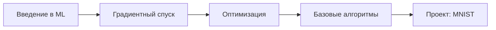
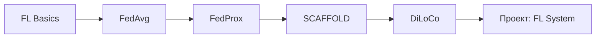
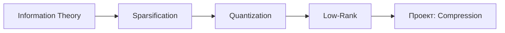
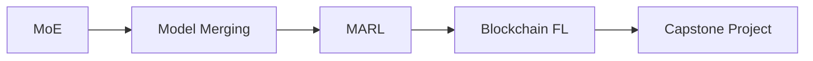

# 🎓 Educational Architecture - Swarm AI Knowledge Graph

## 📚 Педагогическая основа

Эта образовательная платформа основана на передовых исследованиях в области обучения:

### 🧠 Научная база

| Методология | Автор/Год | Применение |
|------------|-----------|------------|
| **Bloom's Taxonomy** | Bloom (1956), Anderson (2001) | 6-уровневая структура обучения |
| **Spaced Repetition** | Ebbinghaus (1885), Leitner (1972) | Интервальное повторение |
| **Active Learning** | Bonwell & Eison (1991) | Практика с обратной связью |
| **Microlearning** | Hug (2005) | Модули 5-10 минут |
| **Gamification** | Deterding (2011) | Игровые элементы в обучении |
| **Constructivism** | Piaget (1936), Vygotsky (1978) | Обучение через построение знаний |
| **Flow Theory** | Csikszentmihalyi (1990) | Оптимальный уровень сложности |
| **Cognitive Load Theory** | Sweller (1988) | Управление когнитивной нагрузкой |

---

## 🎯 Структура обучения (Bloom's Taxonomy)

### Level 1: Remember (Запоминание)
**Цель**: Вспомнить базовые концепции

**Методы**:
- 📇 Flashcards (карточки)
- 📝 Quizzes (тесты)
- 🔤 Glossary (глоссарий)
- 🎯 Matching exercises (сопоставление)

**Примеры**:
- "Что такое FedAvg?"
- "Назовите 3 типа федеративного обучения"
- "Какая формула используется в SGD?"

---

### Level 2: Understand (Понимание)
**Цель**: Объяснить концепции своими словами

**Методы**:
- 📖 Interactive explanations (интерактивные объяснения)
- 🎥 Video tutorials (видео уроки)
- 📊 Infographics (инфографика)
- 💬 Discussion forums (форумы обсуждений)

**Примеры**:
- "Объясните разницу между FedAvg и FedProx"
- "Почему градиентное сжатие важно?"
- "Как работает MoE архитектура?"

---

### Level 3: Apply (Применение)
**Цель**: Использовать знания в новых ситуациях

**Методы**:
- 💻 Coding exercises (упражнения по программированию)
- 🧪 Simulations (симуляции)
- 📝 Worksheets (рабочие листы)
- 🎮 Interactive labs (интерактивные лабораторные)

**Примеры**:
- "Реализуйте FedAvg для MNIST датасета"
- "Настройте градиентное сжатие с Top-K"
- "Создайте простой MoE слой"

---

### Level 4: Analyze (Анализ)
**Цель**: Разобрать концепции на составляющие

**Методы**:
- 🔍 Case studies (кейсы)
- 📈 Data analysis (анализ данных)
- 🧩 Problem decomposition (разбор проблем)
- 🔬 Research papers (научные статьи)

**Примеры**:
- "Проанализируйте communication overhead в федеративном обучении"
- "Сравните эффективность разных алгоритмов сжатия"
- "Исследуйте влияние client drift на конвергенцию"

---

### Level 5: Evaluate (Оценка)
**Цель**: Критически оценить решения

**Методы**:
- 🎯 Code review (ревью кода)
- 📊 Benchmarking (бенчмарки)
- 🏆 Peer review (взаимная оценка)
- 📝 Critique (критический анализ)

**Примеры**:
- "Оцените trade-off между accuracy и communication cost"
- "Выберите оптимальный алгоритм для гетерогенной среды"
- "Проведите code review для реализации SCAFFOLD"

---

### Level 6: Create (Создание)
**Цель**: Создать новые решения

**Методы**:
- 🚀 Projects (проекты)
- 🏗️ Build from scratch (создание с нуля)
- 🔬 Research (исследования)
- 🎨 Innovation challenges (инновационные вызовы)

**Примеры**:
- "Создайте систему федеративного обучения для edge devices"
- "Разработайте новый алгоритм агрегации"
- "Постройте dashboard для мониторинга обучения"

---

## 🔄 Spaced Repetition System

### Принцип (Ebbinghaus Forgetting Curve)

```
Память (%)|
100%     |●
         | ╲
 80%     |  ●────── Повторение 1 (1 день)
         |   ╲╲
 60%     |    ●─── Повторение 2 (3 дня)
         |     ╲╲╲
 40%     |      ●── Повторение 3 (7 дней)
         |       ╲╲╲╲
 20%     |         ●─ Повторение 4 (14 дней)
         |__________________
         0  2  4  6  8  10  12  14 (дни)
```

### Интервалы повторения (Leitner System)

| Уровень | Интервал | Критерий |
|---------|----------|----------|
| **Box 1** | Каждый день | Новый материал |
| **Box 2** | Каждые 3 дня | Правильный ответ 1 раз |
| **Box 3** | Каждые 7 дней | Правильный ответ 2 раза |
| **Box 4** | Каждые 14 дней | Правильный ответ 3 раза |
| **Box 5** | Каждый месяц | Усвоено |

---

## 🎮 Gamification Elements

### Система прогресса

1. **Experience Points (XP)**
   - Чтение модуля: +10 XP
   - Решение задачи: +50 XP
   - Прохождение квиза: +25 XP
   - Завершение проекта: +200 XP

2. **Levels**
   ```
   Novice (0-100 XP)
   ↓
   Beginner (100-300 XP)
   ↓
   Intermediate (300-700 XP)
   ↓
   Advanced (700-1500 XP)
   ↓
   Expert (1500-3000 XP)
   ↓
   Master (3000+ XP)
   ```

3. **Badges (Достижения)**
   - 🏆 First Steps - Завершил первый модуль
   - 📚 Bookworm - Прочитал 10 статей
   - 💻 Code Warrior - Решил 20 задач
   - 🔥 Streak Master - 7 дней подряд
   - 🎓 Domain Expert - 100% в категории
   - 🚀 Project Builder - Завершил проект
   - 🏅 Quiz Champion - 10 квизов подряд
   - 🌟 Perfectionist - Все на 100%

4. **Leaderboard (Доска лидеров)**
   - Weekly: Топ-10 за неделю
   - Monthly: Топ-50 за месяц
   - All-time: Все время

---

## 🎯 Learning Paths (Траектории обучения)

### Path 1: Fundamentals (Основы)
**Продолжительность**: 2-3 недели
**Уровень**: Beginner



**Модули**:
1. Introduction to Machine Learning (2h)
2. Gradient Descent Fundamentals (1.5h)
3. Optimization Algorithms (2h)
4. Hands-on: SGD Implementation (3h)

---

### Path 2: Federated Learning (Федеративное обучение)
**Продолжительность**: 4-6 недель
**Уровень**: Intermediate



**Модули**:
1. Federated Learning Introduction (2h)
2. FedAvg Algorithm (3h)
3. Handling Heterogeneity: FedProx (2h)
4. Client Drift: SCAFFOLD (3h)
5. Low-Communication: DiLoCo (2h)
6. Project: Build FL System (10h)

---

### Path 3: Compression Techniques (Сжатие)
**Продолжительность**: 3-4 недели
**Уровень**: Intermediate



---

### Path 4: Advanced Topics (Продвинутые темы)
**Продолжительность**: 6-8 недель
**Уровень**: Advanced



---

## 📱 Microlearning Modules

### Принципы (Hug, 2005)

1. **Короткие** - 5-10 минут
2. **Focused** - одна концепция
3. **Actionable** - сразу применимо
4. **Engaging** - интерактивно

### Структура модуля

```
Module: "FedAvg Algorithm"
├── Duration: 8 minutes
├── Learning Outcome: Understand FedAvg
│
├── 1. Hook (30s)
│   └── "How Google trained Gboard without accessing user data?"
│
├── 2. Concept (2m)
│   ├── What is FedAvg?
│   ├── Why is it important?
│   └── Key components
│
├── 3. Example (2m)
│   ├── Visual walkthrough
│   ├── Step-by-step animation
│   └── Formula breakdown
│
├── 4. Practice (2m)
│   ├── Interactive exercise
│   ├── Fill-in-the-blank
│   └── Code snippet
│
├── 5. Quiz (1m)
│   └── 3 questions
│
└── 6. Next Steps (30s)
    ├── Related modules
    ├── Further reading
    └── Hands-on lab
```

---

## 🧩 Active Learning Strategies

### 1. Think-Pair-Share
```
Individual → Pair → Group
Think (2m) → Discuss (3m) → Share (2m)
```

### 2. Peer Instruction
```
Question → Vote → Discuss → Revote
```

### 3. Problem-Based Learning (PBL)
```
Problem → Research → Hypothesize → Test → Reflect
```

### 4. Flipped Classroom
```
Pre-class: Watch videos, Read materials
In-class: Discussions, Problem-solving, Projects
```

---

## 🎓 Cognitive Load Management (Sweller, 1988)

### Типы когнитивной нагрузки

1. **Intrinsic Load** (Внутренняя)
   - Сложность материала
   - Минимизация: Chunking, Scaffolding

2. **Extraneous Load** (Посторонняя)
   - Неэффективная подача
   - Минимизация: Чистый дизайн, Без отвлечений

3. **Germane Load** (Полезная)
   - Конструирование знаний
   - Максимизация: Практика, Рефлексия

### Практические рекомендации

```
✅ DO:
- Split complex concepts into chunks
- Use worked examples
- Provide scaffolding
- Remove unnecessary information
- Use multimedia wisely

❌ DON'T:
- Overload with information
- Present multiple concepts simultaneously
- Use distracting animations
- Repeat same information in multiple formats
```

---

## 🌊 Flow State (Csikszentmihalyi, 1990)

### Условия для Flow

```
High Skill ──┐
             │
             ├──→ FLOW CHANNEL
             │    (Optimal Learning)
             │
Low Skill ───┘

             Low ←─ Challenge ─→ High
```

**Зона оптимального обучения**:
- Skill level: 70-80% от требуемого
- Challenge: Чуть выше текущего уровня
- Feedback: Немедленная обратная связь

---

## 📊 Assessment Types

### 1. Formative (Текущая)
**Цель**: Проверка понимания в процессе

- Quick quizzes
- Self-checks
- Peer feedback
- Progress indicators

### 2. Summative (Итоговая)
**Цель**: Оценка итоговых знаний

- Module tests
- Projects
- Code reviews
- Capstone

### 3. Diagnostic (Диагностическая)
**Цель**: Определение уровня

- Pre-assessment
- Skill mapping
- Knowledge gaps
- Personalization

---

## 🔄 Adaptive Learning

### Алгоритм адаптации

```python
def adapt_difficulty(student):
    if student.accuracy > 0.9:
        increase_difficulty()
    elif student.accuracy < 0.6:
        decrease_difficulty()
        provide_scaffolding()
    else:
        maintain_difficulty()

def recommend_next_module(student):
    # Item Response Theory (IRT)
    theta = estimate_ability(student)
    modules = get_modules_for_ability(theta)
    return modules[0]
```

### Персонализация

- Learning style (Visual, Auditory, Kinesthetic)
- Pace (Fast track, Normal, Slow)
- Prior knowledge
- Goals (Academic, Professional, Hobby)

---

## 📈 Learning Analytics

### Метрики успеха

| Метрика | Формула | Интерпретация |
|---------|---------|---------------|
| **Completion Rate** | Завершено / Всего | >80% хорошо |
| **Accuracy** | Правильно / Всего | >70% понимание |
| **Time on Task** | Время / Модуль | 5-10 мин оптимально |
| **Retention** | Вернулись через 7 дней | >60% хорошо |
| **Engagement** | Активность / День | >3 действия |

---

## 🎯 Implementation Roadmap

### Phase 1: Foundation (1-2 месяца)
- [ ] Создать модульную структуру
- [ ] Разработать flashcards
- [ ] Добавить quizzes
- [ ] Система прогресса

### Phase 2: Interactivity (2-3 месяца)
- [ ] Coding exercises
- [ ] Interactive visualizations
- [ ] Video tutorials
- [ ] Gamification

### Phase 3: Community (3-4 месяца)
- [ ] Discussion forums
- [ ] Peer review
- [ ] Leaderboards
- [ ] Social features

### Phase 4: Advanced (4-6 месяцев)
- [ ] Adaptive learning
- [ ] AI tutor
- [ ] Personalization
- [ ] Analytics dashboard

---

## 📚 Resources

### Книги
- "How Learning Works" - Ambrose et al., 2010
- "Make It Stick" - Brown, Roediger, McDaniel, 2014
- "The Cambridge Handbook of Multimedia Learning" - Mayer, 2021

### Статьи
- Bloom's Taxonomy: Anderson & Krathwohl (2001)
- Cognitive Load Theory: Sweller (1988, 2011)
- Gamification: Deterding et al. (2011)

---

**Version**: 1.0
**Last Updated**: 2025-11-18
**Authors**: Educational Design Team
